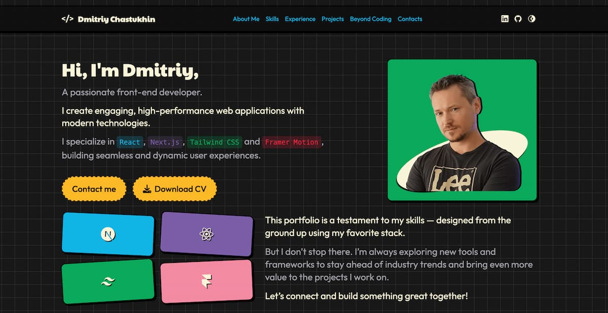

# React & HeroUI Resume

This template serves as an interactive resume showcasing my skills, experience, personal information, contact details, and more. Built with modern web technologies, it provides a comprehensive and engaging way to present my professional profile.

## Interactive Resume Features

- **About**: A personal introduction and background information.
- **Skills**: A detailed overview of my technical and soft skills.
- **Experience**: A timeline of my professional journey, highlighting key roles and achievements.
- **Projects**: Showcasing my work by leveraging the GitHub API to display a curated list of my repositories and contributions.
- **Beyond Coding**: Shortly about my hobbies outside of work.
- **Contact**: Easy ways to get in touch with me, including email and social media links.

## Technologies Used

- [React.js 19](https://react.dev/)
- [Vite](https://vite.dev/)
- [React Query](https://tanstack.com/query/latest)
- [HeroUI v2.6](https://www.heroui.com/)
- [TailwindCSS v4](https://tailwindcss.com/)
- [TypeScript](https://www.typescriptlang.org/)
- [Framer Motion](https://www.framer.com/motion/)
- [GitHub API](https://docs.github.com/en/rest)

## How to Use

### Install dependencies

To create a new project based on this template using Vite, run the following command:

```bash
npm create vite@latest my-vue-app
```

You can use one of the package managers `npm`, `yarn`, `pnpm`, or `bun`.  
Since you're using `npm`, run the following command:

```bash
npm install
```

### Run the development server

```bash
npm run dev
```

Open your web browser and navigate to [http://localhost:5173](http://localhost:5173) to access the app.

## Screenshot



## License

Licensed under the [MIT License](LICENSE).
